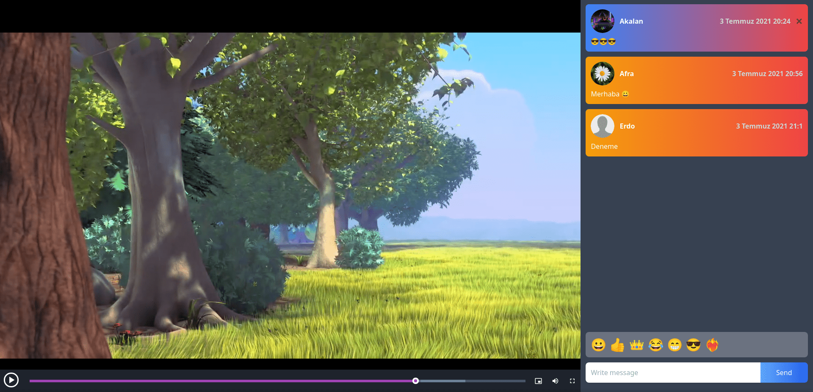

# Screenshot

  

Demo : https://05akalan57.github.io/hls-player-chat/

### Usage

- Open index.html file with browser

### Features

- Send and delete messages
- Set your desired profile picture
- You can play any video you want with the "/video link" command.
- Continue where you left off in videos
- Notification sound etc.

### Warning

- If you want the messages to be recorded in your own database, change the firebase connection information in the index.html file
